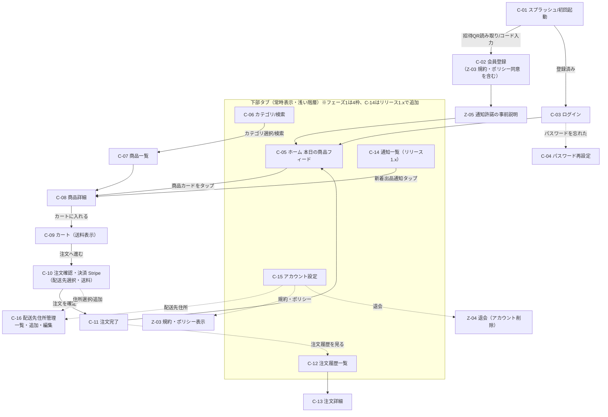
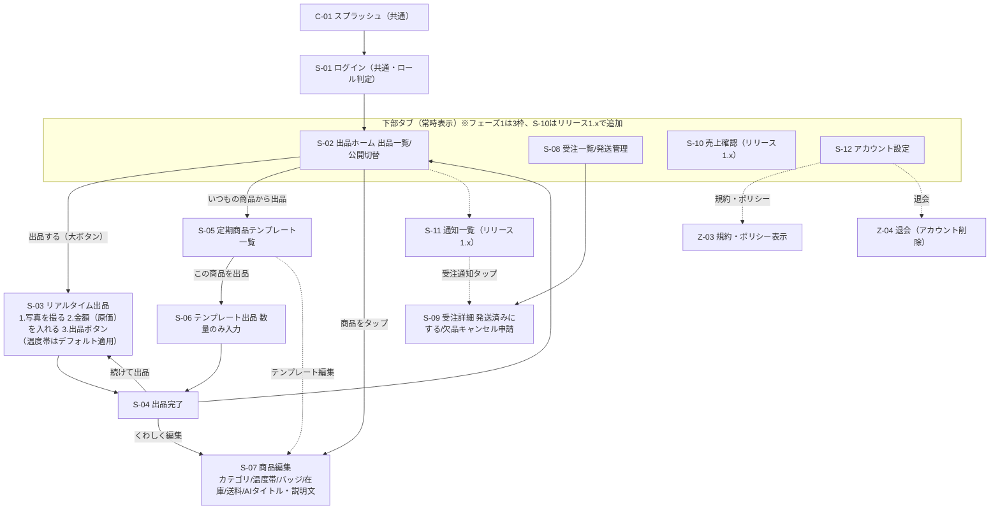
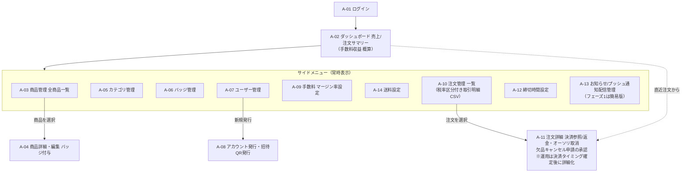

# 北海道一次産業向け受発注アプリプラットフォーム
## 必要な画面一覧（画面遷移案）

- 作成日: 2026-07-16
- 作成者: ITコンサルタント／システムエンジニア
- ドキュメント種別: 要件定義フェーズ成果物（画面一覧・画面遷移案）
- ステータス: **ドラフト（確認事項〔4.3〕の回答をもって確定）**

| 版 | 日付 | 変更内容 |
|---|---|---|
| 1.0 | 2026-07-16 | 初版ドラフト作成 |
| 1.1 | 2026-07-16 | レビュー指摘反映（退会・規約同意・通知許諾画面の追加、資金決済法・インボイス制度・決済確定タイミングの設計前提化、フェーズ間の整合修正 等） |
| 1.2 | 2026-07-17 | 3ドキュメント間整合性レビュー反映（価格モデル＝加算モデルで統一、温度帯・送料・配送先住所・退会等の画面反映、フェーズ用語を「リリース1.x」へ整理、AIタイトル生成の画面対応、要件ID〔F-xxx〕相互対応、欠品時キャンセル申請の画面追加 等） |

> 本書は初回ヒアリングに基づくドラフトであり、確認事項（4.3）の回答をもって確定版へ更新します。要件骨子に明記のない事項は「推奨」「仮置き」と明示しています。

---

## 1. 前提・方針

### 1.1 アプリ構成の推奨案

#### (1) 発注者アプリ／出品者アプリの構成 → **1つのアプリ内でロール分岐（推奨）**

| 観点 | 1アプリ・ロール分岐（推奨） | 2アプリ分離 |
|---|---|---|
| 開発コスト | ◎ 認証・通知・共通UIを1本で共有 | △ 2本分の実装・ビルド管理 |
| ストア申請・審査 | ◎ iOS/Android各1本の申請で済む | △ 各2本（計4申請）の維持が必要 |
| 保守・アップデート | ◎ 修正が1回で全ロールに反映 | △ 2本同時リリースの調整コスト |
| 利用者の迷いにくさ | ○ ログインアカウントの権限で自動的に画面を出し分ければ迷わない | ◎ アプリ名で役割が明確 |
| 将来の拡張（1ユーザーが両ロールを持つ場合） | ◎ アカウント切替で対応可能 | △ アプリを行き来する必要 |

**推奨理由**: 開発期間3〜4ヶ月・招待制のクローズドな利用者層という条件では、開発・審査・保守の負荷を最小化できる1アプリ構成が合理的です。ログイン時にサーバー側で保持するロール（発注者／出品者）に応じて**起動後の画面を完全に出し分ける**ため、利用者がロール選択で迷うことはありません。
※データ・認証基盤は**複数ロールを保持可能な設計**とし（技術文書2-10の通り）、**フェーズ1のUIはログイン時のロールに応じた1ロール表示固定**とします（本書の画面前提は、この「UI上の制約」として再定義しています）。兼任アカウント（発注者・出品者の兼任）の有無は要件定義書 第10章の確認事項とします。

#### (2) 管理者画面 → **Web管理画面（ブラウザ）で提供（推奨）**

- 商品・ユーザー・注文の一覧管理、マージン率設定、CSV出力等は**大画面＋キーボード操作が前提の業務**であり、モバイルアプリより Web が適切。
- アプリのストア審査を経由せず**即日で機能追加・修正が可能**。運用開始直後の調整が多い管理機能に向く。
- PC を持たない管理者が外出先で確認するケースに備え、**レスポンシブ対応（スマホブラウザ閲覧可）を推奨**（仮置き）。

#### (3) 高齢者向けUX原則（出品者側を中心に全画面へ適用）

| # | 原則 | 具体策 |
|---|---|---|
| 1 | **出品は3操作** | 必須操作は「①写真を撮る → ②金額（原価）を入れる → ③出品ボタン」の**3操作**で完結。数量はデフォルト1（変更任意）、温度帯はデフォルト値適用（変更任意）、AI生成・カテゴリ・説明文は任意ステップ（後から編集／管理者が補完）とする |
| 2 | **文字とボタンを大きく** | 本文フォントは 18pt（iOS）／18sp（Android）以上を目安。タップ領域は各プラットフォーム標準の最小値（**iOS HIG: 44×44pt、Android: 48×48dp**。参考: WCAG 2.5.5 / 2.5.8）を下限とし、主要ボタンはこれを明確に上回る**高さ56pt/dp以上**を推奨（推奨値。UI設計時に実機検証のうえ確定） |
| 3 | **階層を浅く** | ホームから2タップ以内で主要機能へ到達。下部タブ＋一覧→詳細の2階層を基本とし、3階層以上のドリルダウンを作らない |
| 4 | 迷わせない導線（推奨） | 戻る先を常に明示、専門用語を使わない（例:「公開」→「売り場に出す」等の文言はUI検討時に協議）、破壊的操作は大きな確認ダイアログ |
| 5 | 入力を減らす（推奨） | 金額は**原価（お渡し希望額）をテンキー直接入力**（マージン加算後の販売価格は自動算出）、定期商品は数量のみ入力、説明文はAI生成（Should）または後から編集で代替 |

### 1.2 法令・ストア審査上の必須対応（設計前提の重大論点）

以下は「確認事項」ではなく**設計の前提として対応必須（または方針決定必須）の論点**です。対応漏れはストア審査リジェクトや法令違反リスクに直結するため、フェーズ1の範囲に組み込んでいます。

| # | 論点 | 対応方針 | 影響画面 |
|---|---|---|---|
| 1 | **アカウント削除（退会）** | App Store Review Guideline 5.1.1(v) により、アプリ内でアカウント登録（招待経由を含む）を提供するアプリは**アプリ内からのアカウント削除手段の提供が必須**（Google Play の「アカウント削除」ポリシーも同様）。招待制・クローズドな利用形態でも免除されない。要件ID **F-112** で要件化 | **Z-04（退会）を新設しフェーズ1必須**。C-15／S-12 から導線 |
| 2 | **利用規約・プライバシーポリシー** | 会員登録で個人情報（氏名・電話・住所）とStripe決済情報を扱うため、個人情報保護法上の利用目的の明示と、App Store／Google Play 審査で要求されるプライバシーポリシーへの導線は必須。**登録時の同意取得＋設定画面からの常時参照**を提供する。要件ID **F-113** で要件化 | **Z-03（規約・ポリシー表示/同意）を新設しフェーズ1必須**。C-02・C-15・S-12 に導線 |
| 3 | **特定商取引法に基づく表記** | 発注者に一般消費者が含まれる場合（BtoC）は掲載必須。事業者限定（BtoB）でも掲載が望ましい。発注者の属性はヒアリング未確認のため確認事項（4.3-7） | Z-03 に併載 |
| 4 | **インボイス制度・消費税（軽減税率）** | 飲食店等の事業者が仕入として購入する場合、買い手の仕入税額控除のため**適格請求書（インボイス）対応が実務上ほぼ必須**。発行主体（出品者発行か、プラットフォームによる**媒介者交付特例**か）の設計と、**出品者の課税/免税区分の管理**が必要（一次産業の出品者には免税事業者が多い可能性が高い）。食品は軽減税率8%が基本（酒類等は10%）で税率管理も必要。要否・方式は確認事項（4.3-8）だが、帳票仕様に直結するため**フェーズ1設計前に方針確定が必要**。当面はフェーズ1で税率区分・税額を含む取引明細CSV（F-208/A-10）を受け皿とする | C-13（領収書/適格請求書表示）、S-10、S-12（課税区分）、A-10（取引明細CSV・帳票出力） |

### 1.3 決済・精算スキームの前提（設計前提の重大論点）

#### (1) 精算スキーム — 資金決済法上の論点（**要否確認ではなく方式選定が必須**）

- プラットフォーム運営会社が購入代金を**いったん自社で収受し、後日出品者へ分配する**構成は、資金決済法上の**為替取引（資金移動業の登録が必要）に該当し得る重大な法的論点**があります。
- このため、**Stripe Connect 等を用いて「代金が出品者に直接帰属し、プラットフォームは手数料（アプリケーションフィー）のみを受領する」スキームを推奨**します。代替として売買契約に基づく「代理受領」構成の法的整理も選択肢ですが、いずれの場合も**弁護士等専門家の確認を、フェーズ1の詳細設計着手前に完了させることを必須マイルストーン**として設定してください。
- なお、要件定義書 第10章#5では、本論点を**取引スキーム（買取再販 or 仲介）の確定**を含む形で最優先確認事項としています。買取再販モデル（プラットフォームが売主）か、マーケットプレイス（仲介）モデルかにより決済構成が変わるため、その確定を待って本節の推奨を精緻化します。
- 本論点は S-12（振込先情報の要否）、S-10（受取額表示）、A-09（手数料）、A-11（返金）の画面仕様に直結します。

#### (2) 決済確定タイミング — 即時決済 か オーソリ→キャプチャ か

締切時間後に出品者が在庫・出荷を確定する業務フローでは、注文時に即時決済すると**欠品・キャンセル時に返金が多発**します。カード決済の業界標準である「**注文時オーソリ（与信枠確保）→締切後・出荷確定時キャプチャ（売上確定）**」との比較検討が必要です。

| 観点 | 即時決済（注文確定時に売上確定） | オーソリ→キャプチャ（推奨・仮置き） |
|---|---|---|
| 実装の単純さ | ◎ 単純 | ○ 部分キャプチャ・オーソリ取消の設計が必要 |
| 欠品・キャンセル時 | △ 返金処理が多発（手数料・入金ズレの運用負荷） | ◎ オーソリ取消のみで返金不要。出荷確定分だけ請求可能 |
| 制約 | — | △ Stripeのカード決済のオーソリ有効期間（**通常7日**）内のキャプチャが必須 |

**推奨（仮置き）**: オーソリ→キャプチャ方式。ただし**締切〜出荷確定のリードタイムが7日を超えるケースの有無**を含め、決済フロー全体を確認事項（4.3-4）として次回打ち合わせで確定します。A-11 の返金運用はこの決定後に詳細化します。
※本項は要件定義書 第10章「決済確定タイミング（即時決済 or オーソリ→キャプチャ）」（優先度・高）と相互参照します。オーソリ有効期間（通常7日）と締切〜出荷確定リードタイムの整合検証を含みます。

### 1.4 機能要件との対応（FR番号と要件定義書 F-xxx の対応）

画面一覧表の「対応する機能要件」列は、本書独自の機能要件番号（FR-xx）を参照します。各FR番号と要件定義書の要件ID（F-xxx）の対応は以下のとおりです。

| FR番号 | 機能要件 | 要件定義書対応（F-xxx） |
|---|---|---|
| FR-01 | 招待制アカウント登録（QRコード・招待コード） | F-205 / F-108 |
| FR-02 | ログイン認証・パスワード管理 | F-108 |
| FR-03 | 本日の商品フィード表示・注文締切時間表示 | F-011 / F-103 |
| FR-04 | 商品カテゴリ分類・商品検索 | F-003 / F-011 |
| FR-05 | 商品詳細表示（バッジ・在庫数・締切） | F-011 / F-004 |
| FR-06 | カート・注文確定 | F-101 / F-102 |
| FR-07 | オンライン決済（Stripe） | F-104 |
| FR-08 | 注文履歴・注文詳細の確認 | F-105 |
| FR-09 | プッシュ通知（新着出品・締切前リマインド・お知らせ） | F-203 |
| FR-10 | リアルタイム出品（写真→金額→出品の最短フロー） | F-002 |
| FR-11 | 定期商品テンプレートからの出品（数量入力のみ） | F-001 |
| FR-12 | 商品編集（カテゴリ・バッジ・在庫・AIタイトル/説明文生成） | F-003 / F-004 / F-006 / F-008 / F-009 |
| FR-13 | 出品の公開／非公開切替 | F-005 |
| FR-14 | 受注一覧・発送管理 | F-106 |
| FR-15 | 出品者の売上確認 | F-209 |
| FR-16 | 管理ダッシュボード（売上・注文サマリー） | F-202 |
| FR-17 | 全商品管理・カテゴリ管理・バッジ付与 | F-003 / F-004 / F-005 |
| FR-18 | ユーザー管理（アカウント発行・権限・招待QR発行） | F-206 / F-205 |
| FR-19 | 手数料（マージン率）設定 | F-207 |
| FR-20 | 注文管理（管理者） | F-105 / F-107 |
| FR-21 | 注文締切時間の設定 | F-103 |
| FR-22 | お知らせ／プッシュ通知の配信管理 | F-204 |
| FR-23 | アカウント設定（プロフィール・通知設定等） | F-108 |
| FR-24 | アカウント削除（退会） | F-112 |
| FR-25 | 利用規約・プライバシーポリシーの表示・同意 | F-113 |
| FR-26 | 送料計算・表示 | F-110 |
| FR-27 | 欠品時の注文取消申請・承認 | F-107 |

※プッシュ通知許諾の事前説明導線（Z-05）は要件 **F-114** に対応します（FR-09関連。OSの通知許諾ダイアログ前のプレパーミッション）。
※配送先住所管理（C-16）は要件 **F-109** に対応します（FR番号は付与せず F-xxx を直接参照）。
※FR-09 のうち「締切前リマインド」、FR-15（F-209）の集計粒度などの詳細仕様はヒアリング未確定のため仮置きです。

---

## 2. 画面一覧表

優先度の定義: **高**＝フェーズ1（初回リリース）必須 ／ **中**＝フェーズ1で簡易版 or リリース1.x ／ **低**＝リリース1.x以降。
（「フェーズ2」＝道の駅・温泉施設・自治体横展開等の**事業拡大**を指す用語として要件定義書3章で定義。リリース直後の機能拡充は「リリース1.x」と表記します。）

### 2.1 発注者向け（モバイルアプリ／ロール: 発注者）

| 画面ID | 画面名 | 概要 | 主な表示要素・操作 | 対応する機能要件 | 優先度 |
|---|---|---|---|---|---|
| C-01 | スプラッシュ／初回起動 | アプリ起動画面。未登録者は招待QR読み取り・招待コード入力へ誘導 | ロゴ、「QRコードを読み取る」「招待コードを入力」「ログイン」ボタン | FR-01, FR-02 | 高 |
| C-02 | 会員登録（招待経由） | 招待QR/コード検証後にアカウント情報を登録 | 招待コード検証結果、事業者名・氏名・電話・メール・パスワード入力、配送先住所（**直接受け渡しの有無〔要件書第10章#1〕により要否変動**）、**利用規約・プライバシーポリシーへの同意（Z-03参照）**、登録ボタン。登録完了後は Z-05（通知許諾の事前説明）へ | FR-01, FR-02, FR-25 | 高 |
| C-03 | ログイン | 登録済みユーザーの認証 | メール（またはID）・パスワード、ログインボタン、パスワード再設定導線 | FR-02 | 高 |
| C-04 | パスワード再設定 | メール経由でのパスワード再設定 | メール入力、再設定リンク送信、新パスワード設定 ※高齢者UXの観点で SMS/メールのワンタイムコード方式（パスワードレスログイン）も比較検討（4.3-11） | FR-02 | 高 |
| C-05 | ホーム（本日の商品フィード） | 本日出品された商品を時系列フィードで表示。各商品に注文締切時間を明示 | 本日の商品カード（写真大・価格・出品者・バッジ・**締切時間/残り時間**・**売り切れ表示**）、お知らせバナー（配信元はA-13簡易版・フェーズ1）、下部タブ | FR-03, FR-05, FR-09 | 高 |
| C-06 | 商品カテゴリ／検索 | カテゴリから商品を探す。キーワード検索窓を併設 | カテゴリ大ボタン一覧（野菜・鮮魚 等）、検索窓（検索機能はリリース1.x仮置き） | FR-04 | 高（検索はリリース1.x） |
| C-07 | 商品一覧（カテゴリ別・検索結果） | 選択カテゴリ／検索条件に合致する商品の一覧 | 商品カード一覧、並び替え（新着・締切が近い順 ※仮置き）、絞り込み | FR-04, FR-03 | 高 |
| C-08 | 商品詳細 | 商品の詳細情報と購入操作 | 写真（複数）、価格、**バッジ（NEW/人気 等）**、**在庫数**、**注文締切時間**、**温度帯（冷凍/冷蔵/常温）**、説明文、出品者名、数量選択、「カートに入れる」、**在庫切れ・締切超過時の購入不可表示** | FR-05, FR-06 | 高 |
| C-09 | カート | 注文予定商品の確認・数量変更 | 商品ごとの数量変更・削除、小計、**送料（内訳表示）**、**合計（商品代金＋送料）**、**締切超過・在庫減少/在庫切れ商品の警告表示**、「注文へ進む」 | FR-06, FR-26 | 高 |
| C-10 | 注文確認・決済 | 注文内容の最終確認とStripe決済 | 注文内容、**配送先（住所選択UI。直接受け渡しの有無〔要件書第10章#1〕により要否変動。C-16で管理）**、**送料（内訳表示）**、合計金額、Stripe決済UI（カード登録・支払い）、「注文を確定する」、**確定時の在庫不足エラー表示（同時注文競合時）** ※決済確定タイミング（即時 or オーソリ→キャプチャ）は1.3(2)の確定に従う | FR-06, FR-07, FR-26 | 高 |
| C-11 | 注文完了 | 注文確定の完了表示 | 注文番号、注文内容サマリー、「ホームへ戻る」「注文履歴を見る」 | FR-06 | 高 |
| C-12 | 注文履歴一覧 | 過去の注文を一覧表示 | 注文日・注文番号・金額・ステータス（受付/発送済 等 ※ステータス定義は仮置き） | FR-08 | 高 |
| C-13 | 注文詳細 | 個別注文の明細確認 | 商品明細、金額内訳（税率別 ※軽減税率8%/10%）、送料、決済状況、発送状況、**領収書/適格請求書の表示（要否・発行主体は1.2-4の確定に従う・仮置き）**、再注文ボタン（推奨・リリース1.x） | FR-08 | 高 |
| C-14 | 通知一覧 | 受信したプッシュ通知・お知らせの一覧 | 新着出品通知、締切前リマインド（仮置き）、運営お知らせ、既読管理 | FR-09, FR-22 | 中（リリース1.x） |
| C-15 | アカウント設定 | 登録情報・通知設定の管理 | プロフィール編集、**配送先住所管理（C-16へ。直接受け渡しの有無〔要件書第10章#1〕により要否変動）**、決済カード管理（Stripe）、通知ON/OFF、**利用規約・プライバシーポリシー参照（Z-03）**、**退会（Z-04）**、ログアウト | FR-23, FR-07, FR-24, FR-25 | 高 |
| C-16 | 配送先住所管理 | 配送先住所の一覧・追加・編集（C-15配下に新設） | 住所一覧、新規追加、編集、既定住所の設定、削除。**直接受け渡しの有無（要件書第10章#1）により要否変動**。発注時（C-10）に選択 | F-109 | 高 |

### 2.2 出品者向け（モバイルアプリ／ロール: 出品者）

| 画面ID | 画面名 | 概要 | 主な表示要素・操作 | 対応する機能要件 | 優先度 |
|---|---|---|---|---|---|
| S-01 | ログイン | 出品者の認証（C-01/C-03と共通画面。ロールにより遷移先が変わる） | メール（ID）・パスワード、ログインボタン | FR-02 | 高 |
| S-02 | 出品ホーム（自分の出品一覧） | 自分が出品中の商品一覧と公開状態の管理 | 出品商品カード（写真・価格・在庫・**公開/非公開トグル**）、大きな「出品する」ボタン、「いつもの商品から出品」ボタン | FR-13, FR-10, FR-11 | 高 |
| S-03 | リアルタイム出品 | **①写真を撮る→②金額（原価）を入れる→③出品ボタン**の3操作最短フロー（1画面内ステップ遷移） | ①カメラ起動・撮影（撮り直し可）②金額＝**原価（お渡し希望額）のテンキー入力＋マージン加算後の販売価格を自動プレビュー表示**③「出品する」大ボタン。数量はデフォルト1（変更任意）、**温度帯は冷凍/冷蔵/常温の3択大ボタン（テンプレート・前回値からのデフォルト適用で追加タップ原則ゼロ・変更任意）**。AI生成・カテゴリ・説明文は任意ステップ（後から編集） | FR-10 | 高 |
| S-04 | 出品完了 | 出品成功のフィードバック | 「出品されました」表示、出品内容プレビュー、「続けて出品」「くわしく編集」導線 | FR-10 | 高 |
| S-05 | 定期商品管理（テンプレート一覧） | 定期的に出す商品のテンプレート一覧・管理 | テンプレートカード（写真・商品名・**原価**・**温度帯**）、「この商品を出品」ボタン、テンプレート新規作成・編集（**温度帯／（送料方式が商品ごと固定の場合）送料欄を含む**） | FR-11 | 高 |
| S-06 | テンプレート出品（数量入力） | テンプレートを選び**数量だけ入力して即出品** | テンプレート内容表示、本日の数量テンキー入力、**原価修正（任意）＋マージン加算後の販売価格の自動プレビュー表示**、**温度帯（テンプレート値をデフォルト適用・変更任意）**、「出品する」 | FR-11 | 高 |
| S-07 | 商品編集 | 出品済み商品・テンプレートの詳細編集 | 写真差替、商品名、**原価（販売価格は自動算出）**、**カテゴリ選択**、**温度帯（冷凍/冷蔵/常温）**、**バッジ選択（NEW/人気を基本。「朝どれ」等はバッジマスタで追加可能な拡張例。出品者への付与権限は要確認〔要件書4.2・第10章#15〕）**、**在庫数**、**（送料方式が商品ごと固定の場合）送料欄**、タイトル・説明文＋**「AIでタイトルと説明文を作る」ボタン**、公開/非公開 | FR-12, FR-13 | 高（AI生成はShould・リリース1.x繰延可） |
| S-08 | 受注一覧／発送管理 | 自分の商品への注文一覧と発送状態の管理 | 注文単位/商品単位の一覧（切替は仮置き）、注文者・数量・金額、発送済みチェック操作 | FR-14 | 高 |
| S-09 | 受注詳細 | 個別受注の明細と発送・欠品対応 | 注文明細、注文者情報・配送先（表示範囲は個人情報方針に合わせ要確認）、**発送指示（宛先・品名・温度帯〔冷凍/冷蔵/常温〕を大きく明示）**、「発送済みにする」大ボタン、**「この注文をキャンセル申請する（欠品時）」操作と申請状態（申請中／承認済／却下）表示** ※出荷確定＝決済キャプチャの契機とする場合は1.3(2)の確定に従う。欠品時の取消申請→管理者承認→返金/オーソリ取消の実行はA-11で行う | FR-14, FR-27 | 高 |
| S-10 | 売上確認 | 自分の売上の確認 | 期間別（日/月）売上合計、**原価×販売数量に基づく受取額（価格モデル＝F-007に従う）**、商品別内訳（仮置き）、税率別内訳・支払通知書等の帳票（**インボイス対応方針の確定後に仕様化**）。※**画面提供はリリース1.x（F-209）**。フェーズ1は管理者からの共有で代替 | FR-15（＝F-209。受取額はマージン率F-207に依存） | 中（リリース1.x） |
| S-11 | 通知一覧 | 受注通知・運営お知らせの確認 | 新規受注通知、締切・運営からのお知らせ、既読管理 | FR-09, FR-22 | 中（リリース1.x） |
| S-12 | アカウント設定 | 出品者情報・通知設定の管理 | プロフィール（屋号・産地等 ※項目は仮置き）、**課税/免税区分・適格請求書発行事業者登録番号（インボイス対応・仮置き）**、振込先情報（**精算スキーム＝1.3(1)の確定後に要否確定**）、通知ON/OFF、**利用規約・プライバシーポリシー参照（Z-03）**、**退会（Z-04）**、ログアウト | FR-23, FR-24, FR-25 | 高 |

### 2.3 管理者向け（Web管理画面）

| 画面ID | 画面名 | 概要 | 主な表示要素・操作 | 対応する機能要件 | 優先度 |
|---|---|---|---|---|---|
| A-01 | ログイン | 管理者認証 | メール・パスワード、（2段階認証は推奨・仮置き） | FR-02 | 高 |
| A-02 | ダッシュボード | 売上・注文状況のサマリー | 本日/今月の売上・注文件数、出品数、直近注文リスト、**手数料収益（概算）**、（グラフ・出品者別/商品別分析はリリース1.xで拡充） ※F-202のフェーズ1受入基準（本日/今月の売上・注文件数・出品数・直近注文・手数料収益〔概算〕の把握）と1対1で一致 | FR-16 | 中（簡易版は高） |
| A-03 | 商品管理（全商品一覧） | 全出品者の商品を横断管理 | 商品一覧（出品者・カテゴリ・価格・在庫・公開状態・バッジ）、検索・絞り込み、公開停止操作 | FR-17 | 高 |
| A-04 | 商品詳細・編集（バッジ付与） | 個別商品の内容確認・修正・バッジ付与 | 商品情報編集、**バッジ付与/解除（NEW/人気を基本、拡張例はバッジマスタで追加）**、カテゴリ変更、公開/非公開 | FR-17, FR-12 | 高 |
| A-05 | カテゴリ管理 | 商品カテゴリの作成・編集・並び順管理 | カテゴリ一覧、追加・名称変更・表示順・無効化 | FR-17, FR-04 | 高 |
| A-06 | バッジ管理 | バッジ（NEW/人気・拡張例）マスタの管理 | バッジ一覧、追加・名称/アイコン編集（付与ルールの自動化はリリース1.x仮置き） | FR-17, FR-05 | 中 |
| A-07 | ユーザー管理（一覧・権限） | 発注者・出品者・管理者アカウントの一覧管理 | ユーザー一覧（ロール・状態）、検索、権限変更、利用停止/再開、**退会済みユーザーの状態表示（データ保持方針は4.3-9の確定に従う）** | FR-18 | 高 |
| A-08 | アカウント発行・招待QR発行 | 新規ユーザーの招待発行 | ロール選択→招待コード発行、**招待QRコード生成・ダウンロード/印刷**、有効期限設定（仮置き）、発行履歴 | FR-18, FR-01 | 高 |
| A-09 | 手数料（マージン率）設定 | プラットフォーム手数料率の設定 | 全体マージン率設定、（出品者別・カテゴリ別の個別率は要否未確定のため仮置きでリリース1.x）、改定履歴 | FR-19 | 高 |
| A-10 | 注文管理（一覧） | 全注文の横断管理 | 注文一覧（日時・発注者・出品者・金額・決済状況・発送状況）、検索・絞り込み、**税率区分・税額を含む取引明細CSV出力（F-208。経理/振込・インボイス実務の当面の受け皿・フェーズ1）**、**帳票出力（適格請求書・媒介者交付特例の要否は1.2-4の確定に従う）** | FR-20 | 高 |
| A-11 | 注文詳細（管理者） | 個別注文の詳細確認・対応 | 注文明細、Stripe決済情報参照、キャンセル/返金・オーソリ取消処理、**出品者からの欠品時キャンセル申請（S-09）の承認→返金（キャプチャ後）/オーソリ取消（キャプチャ前）の実行（F-107）** ※運用フローは決済確定タイミング＝1.3(2)の確定後に詳細化・要協議 | FR-20, FR-07, FR-27 | 高 |
| A-12 | 締切時間設定 | 注文締切時間の設定 | 締切時刻の設定（全体一律か、出品者別/商品別かは未確定のため**全体一律を仮置き**）、変更履歴 | FR-21, FR-03 | 高 |
| A-13 | お知らせ／プッシュ通知配信管理 | 利用者向けお知らせとプッシュ通知の作成・配信 | **フェーズ1（簡易版）: テキストのみの即時配信（C-05お知らせバナーの配信元）**。リリース1.x: 配信先ロール指定・予約配信・配信履歴の拡充 ※新着出品・受注の自動通知はシステム側で自動送信（画面不要） | FR-22, FR-09 | 中（簡易版は高） |
| A-14 | 送料設定 | 送料の方式・金額の設定（**新設・フェーズ1簡易版**） | 送料方式（**商品ごと固定／サイズ×地域テーブル**は要件書第10章#1の確定に従う）、金額設定、配送不可地域・離島の扱い（仮置き）、改定履歴。**送料方式が「商品ごと固定」の場合はS-07・テンプレート（S-05/S-06）に送料欄を設ける**（S-07注記参照） | FR-26 | 高（簡易版） |

### 2.4 共通画面（全ロール）

| 画面ID | 画面名 | 概要 | 対応する機能要件 | 優先度 |
|---|---|---|---|---|
| Z-01 | エラー／通信オフライン表示 | 通信エラー・障害時の案内（圏外の多い地域での利用を想定）。表示要素に**「電話で聞く」ボタン（tel:発信）**、**オフライン時の「あとで自動送信」待ち表示**（画像のローカルキュー・自動再送状況）を含む。エラー時サポート導線・オフライン出品継続（F-115）に対応 | F-115 | 高 |
| Z-02 | 強制アップデート案内 | 旧バージョン利用時の更新誘導（運用上の推奨画面） | 非機能（推奨） | 中 |
| Z-03 | 利用規約・プライバシーポリシー表示／同意 | 登録時（C-02）の同意取得と、設定画面（C-15/S-12）からの常時参照。特定商取引法に基づく表記の掲載も本画面に併載（発注者属性の確定後に要否判定） | FR-25 | 高 |
| Z-04 | 退会（アカウント削除） | **App Store Guideline 5.1.1(v) 対応の必須画面**。C-15/S-12から遷移。注意事項表示（未発送注文・未精算売上がある場合の制御）、確認ダイアログ、削除実行 ※未発送注文・未精算売上・Stripe顧客データの扱いは4.3-9で確定 | FR-24 | 高 |
| Z-05 | プッシュ通知許諾の事前説明（プレパーミッション） | OSの通知許諾ダイアログ表示前に価値を説明する画面（例:「新しい商品が出たらすぐお知らせします」）。登録完了後（C-02→本画面→C-05）に表示。新着出品通知は本サービスの中核価値であり、許諾取得率が事業KPIに直結するためフェーズ1必須 | F-114 | 高 |

---

## 3. 画面遷移図

### 3.1 発注者（モバイルアプリ）

### 3.2 出品者（モバイルアプリ）

### 3.3 管理者（Web管理画面）

---

## 4. 画面数サマリーと開発優先度

### 4.1 画面数サマリー

| ロール | 画面数 | 内訳（優先度 高／中） |
|---|---|---|
| 発注者（アプリ） | 16 | 高 15 ／ 中 1（C-14） |
| 出品者（アプリ） | 12 | 高 10 ／ 中 2（S-10, S-11） |
| 管理者（Web） | 14 | 高 11 ／ 中 3（A-02, A-06, A-13 ※A-02/A-13は簡易版を高としてフェーズ1に含む） |
| 共通 | 5 | 高 4（Z-01, Z-03, Z-04, Z-05）／ 中 1（Z-02） |
| **合計** | **47** | 高 40 ／ 中 7 |

### 4.2 開発フェーズ切り分け案（開発期間3〜4ヶ月を想定）

**フェーズ1（初回リリース・約3〜4ヶ月）— 「出品→閲覧→注文→決済→発送」のコアループを完成させる**

※フェーズ1は47画面中40画面と規模が大きいため、本切り分けはあくまで機能面からの必須判定です。**実現可能性（体制・工数）の裏付けは別途の概算見積・体制計画にて提示**し、体制条件によってはフェーズ1範囲の再調整（例: A-06 の後ろ倒し、S-07のAI生成をリリース1.xへ繰延 等）を協議させてください。

| 領域 | 対象画面 | 補足 |
|---|---|---|
| 認証・招待・コンプライアンス | C-01, C-02, C-03, C-04, S-01, A-01, A-07, A-08, Z-03, Z-04, Z-05 | 招待制とストア審査要件の根幹。**Z-03（規約同意）・Z-04（退会）は審査必須要件のためフェーズ1から除外不可**。C-04（パスワード再設定）は、運営による手動再設定は本人確認・パスワード伝達経路のセキュリティリスクがあり、高齢者主体で発生頻度・問い合わせ負荷も高いと想定されるため**フェーズ1に含める**（方式は4.3-11で確定） |
| 発注コア | C-05, C-06（カテゴリのみ）, C-07, C-08, C-09, C-10, C-11, C-12, C-13, C-15, **C-16** | 締切時間表示・バッジ表示・在庫表示（売り切れ・在庫競合時の警告含む）・温度帯表示・**送料表示（C-09/C-10）**・配送先住所管理（C-16）・Stripe決済を含む。決済確定タイミングは1.3(2)の確定に従い詳細設計 |
| 出品コア | S-02, S-03, S-04, S-05, S-06, S-07（**AI生成＝Should・任意ステップ。工数によりリリース1.x繰延可**）, S-08, S-09, S-12 | 3操作出品と定期商品テンプレートは高齢出品者の定着に直結するためフェーズ1必須。温度帯選択（S-03/S-05/S-06/S-07）・欠品キャンセル申請（S-09）を含む |
| 管理コア | A-02（簡易版: 件数・金額・手数料収益概算）, A-03, A-04, A-05, A-09, **A-10（注文一覧＋税率区分付き取引明細CSV出力）**, A-11, A-12, **A-13（簡易版: テキストのみの即時配信）**, **A-14（送料設定・簡易版）** | 手数料率・締切時間・送料・バッジ付与は運用開始初日から必要。**C-05のお知らせバナーの配信手段としてA-13簡易版をフェーズ1に含める**（画面なしの手動配信＝DB直接操作は運用リスクがあるため不採用） |
| 自動通知 | Z-05 ＋（配信画面なし・基盤実装） | 新着出品・受注のプッシュ自動通知はフェーズ1で基盤実装。許諾取得率確保のためZ-05をセットで実装 |
| 共通（信頼性・オフライン） | **Z-01** | エラー・通信オフライン表示。「電話で聞く」導線（tel:）とオフライン時の「あとで自動送信」待ち表示（画像のローカルキュー・自動再送）を含む。圏外の多い現場での出品継続に直結（F-115対応）するためフェーズ1へ引き上げ |

**リリース1.x（フェーズ1完了後の機能拡充）**

| 対象画面・機能 | 理由 |
|---|---|
| C-06 キーワード検索 | 商品数が少ない立ち上げ期はカテゴリ導線で十分 |
| C-14・S-11 通知一覧 | 通知はOSのプッシュ受信で当面代替可能。**フェーズ1の発注者下部タブは4枠（ホーム/カテゴリ/注文履歴/アカウント）、出品者は3枠（出品/受注/アカウント）とし、リリース1.xで通知タブ・売上タブを追加**（3.1/3.2の遷移図に明記） |
| S-07 AI生成（タイトル・説明文）ボタン | Should。**手入力＋定型テンプレートへ縮退できる設計を前提とした「フェーズ1目標」**であり、工数状況によりリリース1.xへ繰延可 |
| S-10 売上確認 | 立ち上げ期は管理者からの共有で代替可能（要協議）。**画面提供はリリース1.x（F-209）**。受取額表示は価格モデル（F-007）に従う。インボイス対応方針の確定後に帳票仕様を含めて実装 |
| A-02 ダッシュボード拡充（グラフ・出品者別/商品別分析）、A-06 バッジ管理、A-13 拡充（配信先ロール指定・予約配信・配信履歴） | 簡易配信（A-13簡易版）・固定バッジ・簡易ダッシュボード（手数料収益概算まで）で初期運用可能 |
| Z-02 共通画面、C-13 再注文 | 運用安定化・利便性向上の位置づけ |

### 4.3 次回確認事項（ヒアリングで確定が必要な仮置き項目）

1. **兼任アカウント**の有無（発注者・出品者の兼任。フェーズ1のUIは1ロール表示固定、基盤は複数ロール保持可能な設計）— 1.1(1) の前提に影響（要件書 第10章にも計上）
2. **配送・受け渡し方法**（配送先入力の要否、送料の扱い、直接受け渡しの有無）— C-02/C-10/C-16/S-09/A-14 の仕様に影響
3. **締切時間の粒度**（全体一律か、出品者別・商品別か）— A-12 の仕様に影響
4. **決済フロー全体の確定** — (a) 精算スキーム（Stripe Connect 等、1.3(1)の法的整理。取引スキーム〔買取再販 or 仲介〕の確定・弁護士確認を含む）、(b) **決済確定タイミング（即時決済 or オーソリ→キャプチャ）**、(c) オーソリ有効期間（通常7日）と締切〜出荷確定リードタイムの整合、(d) 返金・オーソリ取消の運用 — S-12/A-11/C-10 に影響
5. 注文ステータスの定義（受付／発送済 等）と、締切前リマインド通知の要否
6. 手数料率の設定単位（全体一律か、出品者別・カテゴリ別か）
7. **発注者の属性**（事業者限定か、一般消費者を含むか）— 特定商取引法に基づく表記の要否（Z-03）に影響
8. **インボイス（適格請求書）対応** — 発行要否、発行主体（出品者発行／プラットフォームの媒介者交付特例）、出品者の課税/免税区分の管理方法、軽減税率8%/10%の扱い — C-13/S-10/S-12/A-10 に影響
9. **退会時のデータ取り扱い** — 未発送注文・未精算売上がある場合の退会制御、Stripe顧客データ・取引履歴の削除/保持方針（法定保存義務との整合）— Z-04/A-07 に影響
10. **在庫引当タイミング**（カート投入時か注文確定時か）と、同時注文競合時の画面挙動 — C-08/C-09/C-10 に影響
11. **パスワード再設定の方式** — メールリンク方式か、SMS/メールのワンタイムコード方式（パスワードレスログイン。高齢者UXとの相性が良い）か — C-03/C-04 に影響

以上
